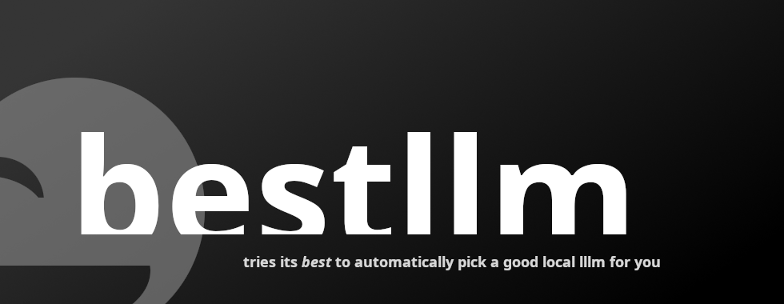

# bestllm

> Picks the most capable local LLM your machine can comfortably run, with zero guesswork.

[](pyproject.toml)
[](#roadmap)
[](https://docs.astral.sh/ruff/)

bestllm is a hardware-aware companion inspired by Timothy Crosley's developer tools. It inspects your system, compares it against curated model profiles, and returns the right local model for the job—no spreadsheet required.

## Highlights
- Understands your hardware with lightweight, cross-platform detection.
- Ships with curated GPU and CPU friendly GGUF profiles and their resource budgets.
- Provides a friendly CLI plus a composable Python API for deeper integrations.
- Fails fast with actionable messages when your machine does not meet a model's needs.
- Designed to be extended: drop in new profiles or swap out detectors without rewriting core logic.

## Quick Start

### Installation
```bash
python -m pip install -e .
```
Need dev tooling too? Grab the extras:
```bash
uv pip install --group dev .
```

### Run the CLI
```bash
bestllm
# or
python -m bestllm
```
Expect output similar to:
```text
Recommended model: llama3-8b-instruct-q4 (8,192 token context window).
Summary: requires >= 16GB RAM, >= 4 CPU cores, 10 GPU VRAM requirement.
Detected GPU VRAM: 12GB — using GPU-friendly profile.
```

### Use from Python
```python
from bestllm import best_local_llm

profile = best_local_llm()
print(profile.name)
print(profile.as_dict())
```

## How It Works
- `bestllm.hardware.HardwareSpecs` captures total RAM, CPU cores, and GPU VRAM.
- `bestllm.models` defines the catalog of `ModelProfile` objects (size, context window, and resource requirements).
- `bestllm.selector.recommend_model_for_specs` scores the catalog against your hardware and raises a clear error if nothing fits.
- `bestllm.__init__` exposes a minimal API and wires everything into the console script entry point.

## Extending the Model Catalog
1. Open `src/bestllm/models.py` and add a `ModelProfile` to `DEFAULT_MODEL_PROFILES`.
2. Document resource requirements and noteworthy constraints in the `notes` field.
3. Re-run `bestllm` to confirm the new profile appears when the hardware qualifies.
4. Add targeted tests under `tests/models/` (mirroring the `src/bestllm` layout) to lock down the new behavior.

## Configuration Tips
- Pair bestllm with your runner scripts to auto-pick the right `gguf` file before launch.
- Override hardware detection in constrained environments by instantiating `HardwareSpecs` manually and passing it to `recommend_model_for_specs`.
- Guard long-context models behind feature flags so CI and lightweight machines stick to CPU options.

## Roadmap
- Smarter scoring that accounts for quantization preferences and batching strategies.
- Built-in adapters for popular launchers (Ollama, llama.cpp, vLLM) via optional extras.
- Configurable profile sources (TOML/JSON) so catalogs can live outside the codebase.
- Hardware detection helpers for AMD and Apple GPUs without shelling out to vendor tools.

## Contributing
- Ensure `ruff check src` and `ty src` pass before sending a PR.
- Keep new features isolated in their own modules under `src/bestllm/` and surface them through `bestllm.__init__`.
- Add or update `tests/` alongside feature changes; we mirror the runtime package layout for discovery.
- Share CLI transcripts or screenshots when behavior changes—context speeds up reviews.

## Inspiration & Credits
bestllm follows the pragmatic tooling ethos of Timothy Crosley projects: approachable defaults, thoughtful ergonomics, and extensibility baked in. Thanks for exploring, and feel free to shape the future roadmap with issues or discussions.
